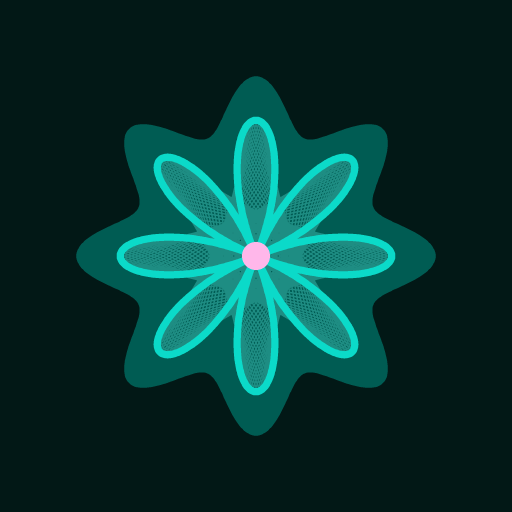

<p align="center"></p>

# tailnet-apps

Small personal web apps, self-hosted on any Docker host and served privately to your
[Tailscale](https://tailscale.com) tailnet at `https://apps.<tailnet>.ts.net/<app>/`. Tailscale does the auth: every
request carries the viewer's tailnet login, so there are no accounts or passwords to manage.

| App                      | What it does                                                                                          |
| ------------------------ | ----------------------------------------------------------------------------------------------------- |
| [`flats`](apps/flats)    | Watches Rightmove saved searches, triages new listings by swiping, and times commutes with the TfL API |
| [`money`](apps/money)    | Net worth over time, bank transactions split into tagged line items, and investment holdings          |
| [`tasks`](apps/tasks)    | A personal to-do list with dependencies, a board and a critical-path timeline                         |
| [`status`](apps/status)  | Health of the stack: services, job queue, schedules and recent failures                               |

One Bun server hosts every app. Each app is its own workspace package owning its routes, its Postgres schema,
its migrations, its prefix in object storage and its React UI, so any one of them can move to its own server later.
All of them install together as one PWA with Web Push notifications, and serve their tools to Claude over one MCP
server.

```
packages/core     shared runtime: config, identity, server, jobs, migrations, blob storage, push, test harness
apps/<slug>       one app: src/api (routes + drizzle schema), src/web (React), src/contract.ts (zod), drizzle/
server            composition root: the app list, the server, worker and migrate entrypoints
scripts/build.ts  bundles server + UIs into a self-contained dist/
deploy/           the production stack, the host's deploy script and its .env template
```

## Use from Claude

Every app's functionality is also served over MCP (Streamable HTTP, stateless) at `https://apps.<tailnet>.ts.net/mcp`,
or one app alone at `/<slug>/mcp`. It acts as the same Tailscale identity as the web apps and works from any client
on a tailnet device, e.g. Claude Code:

```sh
claude mcp add --transport http --scope user apps https://apps.<tailnet>.ts.net/mcp
```

Clients that connect from the cloud rather than your device, such as claude.ai's custom connectors, cannot reach the
tailnet.

## Develop

Needs [Bun](https://bun.sh) and Docker.

```sh
bun install
bun run db:up        # Postgres on localhost:5499, Garage S3 on localhost:3900
bun run db:migrate
bun run dev          # http://localhost:3000, hot reload; trusts DEV_USER from .env.development instead of Tailscale
```

```sh
bun run lint         # biome; `bun run format` to fix
bun run typecheck
bun test             # against the real test database and Garage
```

To see a UI change everywhere at once, `bun scripts/ui-harness/shoot.ts` screenshots every page in each theme,
colour scheme and viewport into a contact sheet; its options are in the file's header. It serves this checkout's UI
with data read from the deployed stack over the tailnet, forwarding only GET and HEAD, and needs Playwright's Chromium
once: `bunx playwright-core install chromium`.

Adding an app, changing a schema, sending notifications and storing files: see
[`packages/core/README.md`](packages/core/README.md).

## Deploy

Every push to `main` is checked, built into `ghcr.io/<owner>/<repo>:<sha>` and, once a host is configured, deployed
over the tailnet with automatic rollback. The stack joins the tailnet as its own `apps` device and publishes nothing
on the host. Fork the repo and follow [`deploy/README.md`](deploy/README.md) to run your own.
